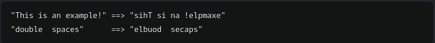

# Instructions

- Complete the function that accepts a string parameter, and reverses each word in the string. All spaces in the string should be retained.

Examples:

[Link](https://www.codewars.com/kata/5259b20d6021e9e14c0010d4/train/javascript) for this codewar challenge if you want to give it a try yourself!
