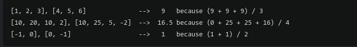

# Instructions

Complete the function that:

- accepts two integer arrays of equal length
- compares the value each member in one array to the corresponding member in the other
- squares the absolute value difference between those two values
- and returns the average of those squared absolute value difference between each member pair.

Examples:

[Link](https://www.codewars.com/kata/51edd51599a189fe7f000015/train/javascript) for this codewar challenge if you want to give it a try yourself!